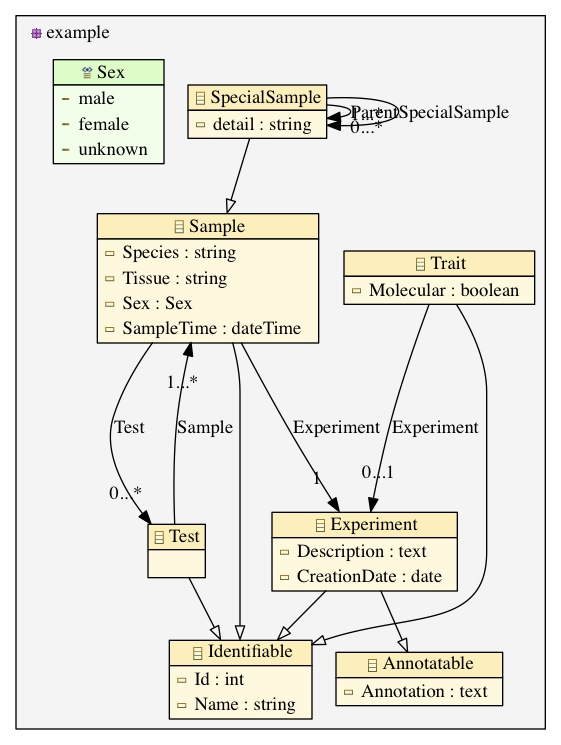

Molgenis-EMF
===========

Tools for converting Molgenis models to UML and Ecore XMI and back using the EMF framework. The conversion supports modelling details available in Ecore.

# MolgenisToUML/Ecore
## TODO
- Remove Molgenis internals (e.g. __Type attribute)
- Many-to-many relationships are implemented without intermediating class
- 
## Ecore example
[Molgenis DSL](molgenis-emf/src/test/resources/simple_model/molgenis_db.xml):

